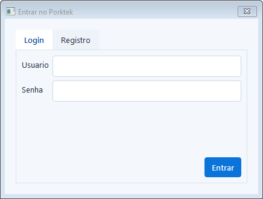
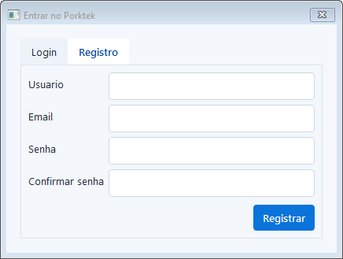
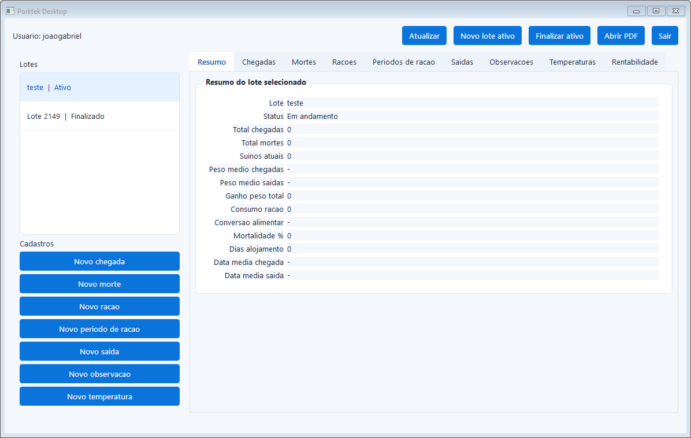
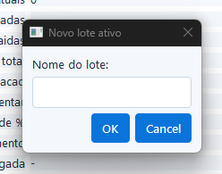
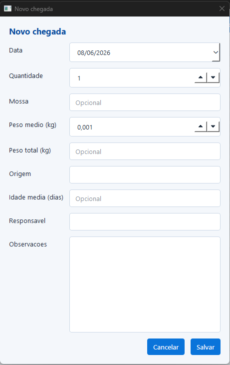
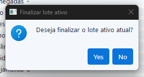

# PorkTek - Sistema

Este repositorio apresenta imagens do sistema desenvolvido para o projeto PorkTek. O sistema utiliza o mesmo backend do aplicativo PorkTek, criado como Trabalho de Conclusao de Curso (TCC).

O objetivo desta versao e mostrar o funcionamento visual da plataforma. O codigo-fonte é privado e nao esta disponivel publicamente neste repositorio.

## Sobre o sistema

O sistema foi desenvolvido para auxiliar no gerenciamento de informacoes relacionadas ao PorkTek, permitindo o cadastro, acompanhamento e organizacao de dados atraves de uma interface simples.

Ele se conecta ao backend principal do PorkTek, compartilhando a mesma base de dados e regras de negocio utilizadas pelo aplicativo.

## Funcionalidades apresentadas

- Tela de entrada no sistema.
- Cadastro de usuario.
- Registro de informacoes.
- Tela inicial com visao geral do sistema.
- Criacao de novo lote.
- Finalizacao de lote.

## Imagens do sistema

### Tela de entrada

### Registro

### Inicio

### Novo lote

### Cadastro de dados no lote

### Finalizar lote

## Acesso ao codigo

O codigo deste sistema e privado. Caso tenha interesse em conhecer melhor o projeto, acessar o codigo ou conversar sobre a solucao, entre em contato comigo.

## Observacao

Este repositorio tem finalidade demonstrativa e contem apenas imagens da interface do sistema.
